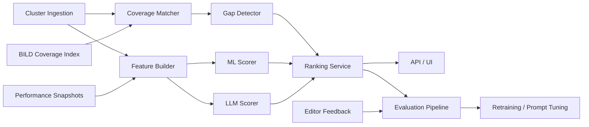

# Story Radar Relevanzsystem

## A. Executive Recommendation

- Empfohlene Zielarchitektur: ein modularer Python-Monolith mit klar getrennten Modulen für Ingestion, Coverage, Feature-Building, ML-Scoring, LLM-Scoring, Ranking, Evaluation und Feedback. Das passt zur aktuellen Repo-Realität, hält Betrieb und Ownership einfach und ist trotzdem sauber genug für spätere Extraktion.
- `graphD` sollte vollständig als Legacy-Signal behandelt und an allen Grenzen aktiv entfernt werden: im Ingress, in persistierten Tabellen, in Ranking-Pipelines, in API-Responses, in UI-Bindings und in Experiment-Konfigurationen. Im Starter ist das durch `story_radar/graphd_removal.py` und `sql/002_remove_graphd_score.sql` angelegt.
- Dual-Track ist sinnvoll, weil ML und LLM unterschiedliche Stärken haben:
  - Klassisches ML ist robuster, billiger, latenzärmer und besser für kontinuierliche Re-Scorings auf allen Clustern.
  - LLM-as-a-judge ist adaptiver, redaktionell sprachfähiger und deutlich besser bei Why-now, Story-Angle und der Unterscheidung zwischen Lücke, Follow-up und Standardrauschen.
- Erwartete Gewinner je Dimension:
  - Robustheit: ML
  - Kosten: ML
  - Latenz: ML
  - Dynamische Anpassung ohne Retraining: LLM
  - Redaktionelle Erklärbarkeit: LLM
  - Langfristige Produktionsreife: ML als Primärpfad, LLM als Shadow/Judge oder Hybrid
- Faire Vergleichslogik:
  - identische Cluster-Inputs
  - identische Coverage- und Performance-Kontexte
  - identische Suppression-Regeln
  - identische Bewertungsfenster
  - Blind-Rating ohne Sicht auf Modellname
  - Offline nDCG/precision@k plus Shadow-Mode plus kleines Online-Interleaving

**Empfehlung:** Primär ML-Ranker mit Rolling Retraining auf aktuellem BILD-Verhalten, parallel LLM-Judge als zweite Spur. Nach 2 bis 4 Wochen Vergleich entweder ML-only beibehalten oder Hybrid aktivieren, wenn LLM messbar mehr echte Coverage-Gaps mit vertretbaren Kosten bringt.

## B. What “Relevant for BILD” Means

Eine relevante Geschichte für BILD ist kein allgemeiner Nachrichtenwert, sondern die Schnittmenge aus:

- hohem Nachrichtenwert
- starker emotionaler oder alltagsnaher Anschlussfähigkeit
- realistischer Klick- oder Erwartungswahrscheinlichkeit für BILD-Leser
- aktueller Unterabdeckung auf BILD
- klar ableitbarem Story-Angle
- ausreichender Konkretheit für eine redaktionelle Weiterverarbeitung jetzt

**Positive Dimensionen**

- Nachrichtenwert:
  - Breaking, Eskalation, Konflikt, starke Konsequenzen, Überraschung
- Emotionalität / Fallhöhe:
  - Opfer, Täter, Prominenz, Schicksal, Angst, Wut, Schaden, Triumph
- Nutzwert / Service:
  - Preise, Bahn, Wetter, Rente, Steuer, Gesundheit, Mobilität, Sicherheit
- Exklusivitäts- oder Überraschungspotenzial:
  - neuer Winkel, fehlendes Detail, regionale oder konkrete Folgen
- Personen-/Promi-/Politik-/Verbraucher-/Kriminalitätsbezug:
  - bekannte Figuren, Macht, Skandal, Blaulicht, Verbraucherthema
- Anschlussfähigkeit an BILD-Tonalität:
  - klar zuspitzbar, personifizierbar, erzählbar, nicht akademisch
- Erwartbare Leserresonanz:
  - aktuelles Performance-Muster ähnlicher BILD-Stories
- Aktualität / Zeitkritikalität:
  - jetzt relevant, nicht nur abstrakt wichtig
- Vorhandene Abdeckung auf BILD:
  - hat BILD das Thema schon, und falls ja, wie gut und wie aktuell?
- Berichterstattungslücke:
  - fehlt das Thema ganz, fehlt ein Angle, fehlt ein Update oder fehlt die konkrete Leserrelevanz?

**Was explizit nicht gezeigt werden soll**

- Standard-Agenturrauschen
- generische Pflichtmeldungen ohne BILD-Winkel
- Dubletten oder fast identische Cluster
- Themen, die BILD bereits aktuell und ausreichend abgedeckt hat
- unklare Meldungen ohne belastbaren Story-Kern
- Politik-/Wirtschafts-/EU-Bürokratie ohne direkte Leserfolgen
- thematisch richtige, aber erzählerisch schwache Cluster

## C. Target Architecture



**Pragmatischer Zuschnitt**

- `cluster ingestion`
  - nimmt Story-/Topic-Cluster entgegen, dedupliziert, normalisiert, entfernt `graphD`
- `bild coverage lookup`
  - sucht exakte und semantische Treffer gegen den aktuellen BILD-Bestand
- `feature extraction`
  - baut dynamische Cluster-, Coverage- und Performance-Features
- `gap detector`
  - entscheidet zwischen `already_covered`, `partially_covered`, `not_covered`, `angle_gap`, `follow_up`
- `ML scorer`
  - primärer, billiger, schneller Ranker
- `LLM scorer`
  - vergleichbare Zweitmeinung mit redaktioneller Begründung
- `ranking service`
  - erzeugt `ml`, `llm` und `hybrid` Varianten mit gleichen Suppression-Regeln
- `evaluation pipeline`
  - offline evaluation, shadow metrics, Blind-Rating-Auswertung
- `feedback loop`
  - Editor-Aktionen werden zu Labels und Trainingssignalen
- `admin/debug view`
  - Coverage-Matches, Suppression-Reason, Score-Komponenten, Drift-Indikatoren

**Warum modularer Monolith**

- ein Team kann das Ende-zu-Ende besitzen
- dieselbe Sprache für Inferenz, API, Evaluation und Batch-Jobs
- kein Kafka, keine Agenten-Orchestrierung, keine Vector-DB nötig
- einfacher Shadow-Mode: beide Scores in einem Run persistieren

Im Starter steckt diese Struktur bereits in:

- `story_radar/ingestion.py`
- `story_radar/coverage.py`
- `story_radar/features.py`
- `story_radar/ml_scorer.py`
- `story_radar/llm_scorer.py`
- `story_radar/ranking.py`
- `story_radar/evaluation.py`
- `story_radar/service.py`
- `story_radar/api.py`

## D. Data Sources and Source-of-Truth

| Quelle | Zweck | Source of Truth |
| --- | --- | --- |
| Story-/Topic-Cluster | primärer Input-Kandidatensatz | Cluster-Pipeline |
| BILD-Artikelbestand | aktuelle Coverage, Match gegen vorhandene Berichterstattung | CMS/Search-Index der publizierten BILD-Artikel |
| BILD-Performance-Daten | Topic-/Entity-/Ressort-Hitze, Resonanz | Analytics/Tracking-Stack |
| CMS-Metadaten | Ressort, Tags, Autorität, Publikationsstatus | CMS |
| Feed-/Wire-Metadaten | Dokumentanzahl, Quellenbreite, Freshness | Feed/Cluster-Pipeline |
| Externe News-Lage | optional Trend-/Breaking-Kontext | nur falls schon vorhanden, nicht als neue Pflicht-Abhängigkeit |
| Redaktionelle Labels | Gold-Labels für Relevanz, Gap, Suppression | Redaktionelles Feedback-Tool |

**Festlegungen**

- Coverage führend:
  - BILD-CMS/Search-Index der aktuell publizierten und zuletzt aktualisierten Artikel
- Performance führend:
  - aktueller BILD-Tracking-Stack; ideal als 15-Minuten- oder 30-Minuten-Snapshot
- Aktualität:
  - `first_seen_at`, `last_seen_at`, Dokumentanzahlwachstum, Quellenwachstum, Zeit seit letzter BILD-Aktualisierung
- “BILD hat die Story schon”:
  - exakter Titel-/Slug-Match oder starker semantischer Match aus Entity- + Topic- + Freshness-Signalen
  - zusätzlich unterscheiden: komplett abgedeckt, teilweise abgedeckt, Angle fehlt, Update lohnt sich

Im Starter ist das per Seed-Daten simuliert:

- `story_radar/sample_data.py`

## E. Data Model

Die produktive Tabellendefinition liegt in `sql/001_story_radar_schema.sql`.

**Tabellen**

- `story_clusters`
  - `cluster_id`, `title`, `summary`, `topics`, `countries`, `source_count`, `document_count`, `first_seen_at`, `last_seen_at`, `freshness_score`, `novelty_score`, `newsroom_labels`, `metadata`
- `cluster_entities`
  - `cluster_id`, `entity_name`, `entity_type`, `salience`
- `cluster_documents`
  - `document_id`, `cluster_id`, `source_name`, `title`, `summary`, `url`, `published_at`, `metadata`
- `bild_coverage_matches`
  - `cluster_id`, `article_id`, `coverage_type`, `title_overlap`, `entity_overlap`, `topic_overlap`, `freshness_delta_minutes`, `confidence`, `missing_angle_tokens`
- `performance_snapshots`
  - `snapshot_id`, `captured_at`, `section_heat`, `entity_heat`, `topic_heat`, `breaking_mode`, `consumer_alert_mode`, `rolling_ctr_index`
- `ml_scores`
  - `cluster_id`, `scoring_run_id`, `ranker_version`, `relevance_score`, `expected_interest`, `confidence`, `feature_values`, `score_components`, `reasons`
- `llm_scores`
  - `cluster_id`, `scoring_run_id`, `model_name`, `relevance_score`, `expected_interest`, `gap_score`, `urgency_score`, `confidence`, `why_relevant`, `why_now`, `why_gap`, `recommended_angle`
- `gap_assessments`
  - `cluster_id`, `coverage_status`, `gap_score`, `coverage_confidence`, `best_match_article_id`, `missing_angle`, `follow_up_potential`, `reason`
- `final_rankings`
  - `cluster_id`, `scoring_run_id`, `model_variant`, `final_rank`, `final_score`, `confidence`, `suppressed`, `suppression_reason`, `ranking_reason`, `explainability`
- `evaluation_labels`
  - `cluster_id`, `label_source`, `editorial_decision`, `outcome_label`, `notes`
- `feedback_events`
  - `cluster_id`, `editor_id`, `action`, `notes`, `payload`, `created_at`

**Beispiel-JSON für einen Cluster**

```json
{
  "cluster_id": "crime-berlin-knife-01",
  "title": "Messer-Angriff in Berliner U-Bahn: vier Verletzte, Täter flüchtig",
  "summary": "Mehrere große deutsche Outlets berichten über einen Angriff in einer Berliner U-Bahn.",
  "entities": ["Berlin", "Polizei", "U-Bahn"],
  "topics": ["crime", "breaking", "public safety"],
  "countries": ["DE"],
  "first_seen_at": "2026-04-24T08:12:00Z",
  "last_seen_at": "2026-04-24T08:31:00Z",
  "source_count": 5,
  "document_count": 9
}
```

## F. ML Model Design

**Empfohlene Problemformulierung**

- primär: Learning-to-Rank
- sekundär: binäre Hilfsklassifikation für Suppression
- optional: separates Regressionsmodell für erwartete Resonanz

**Warum Learning-to-Rank**

- Redaktion entscheidet über Top-K, nicht über absolute Scores
- relative Reihenfolge innerhalb eines Refresh-Zyklus ist das eigentliche Produkt
- gleiche Cluster-Sets können zwischen Weltlagen stark unterschiedliche Priorität haben

**Zielvariable**

Ein positives Ranking-Signal ist kein einzelner Klick, sondern ein zusammengesetztes Outcome:

```text
label = 0.45 * editorial_accept
      + 0.25 * gap_confirmed
      + 0.20 * story_published
      + 0.10 * post_publish_performance_bucket
```

**Positive Beispiele**

- Cluster wurde im Blind-Rating in Top-K gewählt
- Cluster wurde aus Story Radar heraus beauftragt oder publiziert
- Cluster stellte sich als echte Coverage-Lücke heraus
- publizierte Story performte mindestens im oberen Bereich des Ressort-/Topic-Fensters

**Negative Beispiele**

- von Editoren verworfen als `already_covered`
- verworfen als `noise`, `weak_story`, `duplicate`
- angezeigt, aber nie angefasst
- publiziert und klar unterperformt relativ zum Kontext

**Features**

- semantische Cluster-Features:
  - Topic-Fit, Entity-Mix, emotionale Marker, Service-Signale
- Named Entities:
  - Person, Promi, Verein, Ort, Staat, Marke, Behörde
- Ressort-/Topic-Fit:
  - Match zu BILD-typischen Erfolgsclustern
- Aktualität:
  - Rolling Freshness, Dokumentwachstum, Quellenwachstum
- Konkurrenz zu bestehender Coverage:
  - Coverage-Status, Coverage-Confidence, Missing-Angle, Follow-up-Potential
- Novelty:
  - 1 minus Coverage-Confidence plus inhaltliche Differenz
- Performance ähnlicher BILD-Geschichten:
  - Topic-/Entity-/Ressort-Heat der letzten Stunden/Tage
- Zeitbezug / Breaking:
  - Breaking-Modus, Wellenlage, hohe Update-Geschwindigkeit
- Format-/Storyability:
  - klare Personen, klare Folgen, klarer Aufhänger, konkrete Leserrelevanz

**Modellfamilie**

- Baseline:
  - LightGBM `lambdarank`
- Backups:
  - XGBoost ranker
  - Gradient Boosting Klassifikator/Regressor für Warmstart
- Später optional:
  - Embedding-Features zusätzlich, aber kein separater Vector-Store nötig

**Refresh / Retraining**

- Re-Scoring:
  - alle 10 bis 15 Minuten oder event-basiert bei starkem Cluster-Zuwachs
- Feature-Snapshot:
  - 15-/30-Minuten Rolling Windows
- Retraining:
  - täglich leichtgewichtig
  - wöchentlich Volltraining
- Trainingsfenster:
  - Hauptfenster letzte 28 Tage
  - zusätzlich Recency-Weighting über 90 Tage
- Drift Detection:
  - PSI auf Kernfeatures
  - Abfall von precision@10 / suppression precision
  - Resonanz-Delta gegen aktuelle Ressort-Baselines

Im Starter ist der Warmstart- und Trainingspfad in `story_radar/ml_scorer.py` angelegt.

## G. LLM Model Design

**Rolle**

Das LLM soll denselben Job wie das ML-Modell erledigen, aber mit stärkerer redaktioneller Urteilskraft:

- Relevanz für BILD
- Coverage-Lücke
- Why now
- empfehlbarer Story-Angle
- Suppression bei Rauschen

**Input an das LLM**

- Cluster:
  - Titel, Summary, Topics, Entities, Quellenbreite, Dokumentbreite, Zeitfenster
- Coverage:
  - beste BILD-Treffer, Match-Scores, Missing-Angle-Tokens, Freshness-Differenz
- Performance:
  - Topic-Heat, Entity-Heat, Section-Heat, Breaking-Mode, Consumer-Alert-Mode
- Guardrails:
  - “nur gelieferte Fakten nutzen”
  - “kein GraphD”
  - “Standardrauschen unterdrücken”

**Structured Output**

Im Starter via strikt definiertem JSON-Schema in `story_radar/llm_scorer.py`:

- `relevance_score`
- `expected_interest`
- `gap_score`
- `urgency_score`
- `confidence`
- `suppressed`
- `suppressed_reason`
- `why_relevant`
- `why_now`
- `why_gap`
- `recommended_angle`

**Guardrails**

- nur bereitgestellte Fakten
- low confidence bei dünnem Kontext
- feste Antwortstruktur
- Retry nur bei parse/schema failure
- Timeout und Kostenbudget pro Batch

**Kosten- und Latenzsteuerung**

- LLM nur für Top-N Kandidaten je Refresh oder im Shadow-Mode mit Cap
- Batch pro 20 bis 50 Cluster
- harte Kostenbudgets pro Tag
- Cache auf Cluster-Signatur + Coverage-Snapshot
- Background-Scoring statt blocking UI-Path

Im Starter ist das LLM offline-fähig: ohne API-Key liefert `story_radar/llm_scorer.py` einen kontraktsicheren Stub, damit Vergleich und UI-Integration trotzdem laufen.

## H. Gap Detection

Die Gap-Logik ist der Kern des Produkts.

**Regeln**

- exact coverage match
  - Titel-/Slug-Match oder extrem hoher Topic+Entity+Freshness-Treffer
- semantic coverage match
  - Entity- und Topic-Overlap mit BILD-Artikel
- topic overlap
  - Ressort-/Tag-/Topic-Schnittmenge
- entity overlap
  - identische Hauptpersonen/Orte/Organisationen
- freshness window
  - wie alt ist die BILD-Coverage relativ zum Cluster?
- already-covered-but-weakly-covered
  - BILD hat das Grundthema, aber nur dünn oder veraltet
- already-covered-but-missing-angle
  - BILD hat die Pflichtmeldung, aber nicht den zugkräftigen Leserwinkel
- follow-up potential
  - Story ist nicht neu, aber Update oder neue Konsequenz lohnt sich jetzt

**Statusmodell**

- `already_covered`
- `partially_covered`
- `not_covered`
- `angle_gap`
- `follow_up`

**Starter-Implementierung**

- `story_radar/coverage.py`
- Beispiel:
  - `politik-merz-energie-01` => `already_covered`
  - `consumer-bahn-strike-01` => `angle_gap`
  - `crime-berlin-knife-01` => `not_covered`

## I. Ranking Logic

Die finale Ranking-Pipeline trennt fair zwischen Varianten, nutzt aber identische Suppression-Regeln.

**Variantenscores**

```text
ML =
  0.42 * ml_relevance
+ 0.18 * gap_score
+ 0.14 * freshness
+ 0.12 * novelty
+ 0.08 * actionability
+ 0.06 * storyability

LLM =
  0.42 * llm_relevance
+ 0.22 * llm_gap
+ 0.16 * llm_urgency
+ 0.10 * storyability
+ 0.10 * llm_expected_interest

Hybrid =
  0.55 * ML
+ 0.45 * LLM
```

**Suppression**

- `already_covered` ohne starkes Follow-up
- `standard_noise`
- `low_confidence`
- `weak_story`

**Tie-Breaker**

- höherer Gap-Score
- höhere Urgency
- mehr Quellen
- höhere Storyability

**Explainability je Cluster**

- Coverage-Reason
- Top-Feature-Reasons
- Why-now aus LLM

Die konkrete Umsetzung steckt in `story_radar/ranking.py`.

## J. graphD Removal Plan

**Wichtiger Ist-Befund**

- In diesem Workspace gibt es keinen expliziten `graphD`-Bezeichner mehr in den produktnahen Story-Radar-Pfaden.
- Trotzdem ist der Umbau als harte Schutzmaßnahme umgesetzt, damit kein Legacy-Feld still wieder in den neuen Pfad rutscht.

**Umbau**

1. Backend-Ingress
   - alle eingehenden Payloads durch `strip_graphd_fields`
2. Ranking
   - keinerlei graphD-Feature in `FeatureBuilder`, `MLScorer`, `LLMScorer`, `RankingEngine`
3. API Response
   - `assert_graphd_absent` in den Normalisierungsgrenzen
4. UI
   - kein graphD-Feld im neuen API-Vertrag
5. Experiment-Logik
   - nur `ml`, `llm`, `hybrid`
6. Persistenz
   - SQL-Drop in `sql/002_remove_graphd_score.sql`
7. Rückwärtskompatibilität
   - keine fachliche Kompatibilität, nur sichere Ablehnung/Entfernung am Ingress
8. Safe rollout
   - Flag für neuen Ranking-Pfad, aber kein graphD-Fallback mehr

**Starter-Dateien**

- `story_radar/graphd_removal.py`
- `sql/002_remove_graphd_score.sql`
- `tests/test_story_radar_graphd.py`

## K. API Design

Im Starter ist die API an den bestehenden Server gehängt:

- `GET /api/story-radar/clusters`
- `GET /api/story-radar/ranked?model_variant=ml|llm|hybrid`
- `GET /api/story-radar/clusters/:id`
- `GET /api/story-radar/explanations/:id`
- `GET /api/story-radar/evaluation`
- `POST /api/story-radar/rescore`
- `POST /api/story-radar/feedback`
- `GET /api/story-radar/debug/coverage`
- `GET /api/story-radar/debug/suppressed`

Die Adapter-Implementierung liegt in `story_radar/api.py`, eingebunden in `push-balancer-server.py`.

**Beispiel-Response `GET /api/story-radar/ranked?model_variant=hybrid`**

```json
{
  "generated_at": "2026-04-24T08:30:00Z",
  "model_variant": "hybrid",
  "count": 2,
  "items": [
    {
      "cluster": {
        "cluster_id": "crime-berlin-knife-01",
        "title": "Messer-Angriff in Berliner U-Bahn: vier Verletzte, Täter flüchtig"
      },
      "gap_assessment": {
        "coverage_status": "not_covered",
        "gap_score": 0.92
      },
      "ml_score": {
        "relevance_score": 0.93,
        "confidence": 0.84
      },
      "llm_score": {
        "relevance_score": 0.92,
        "why_gap": "BILD hat keinen belastbaren Treffer zum Cluster."
      },
      "ranking": {
        "model_variant": "hybrid",
        "final_rank": 1,
        "final_score": 0.93,
        "suppressed": false,
        "ranking_reason": "BILD hat keinen belastbaren Treffer zum Cluster. | starker BILD-Topic-Fit | Mehrere frische Quellen ..."
      },
      "variants": {
        "ml": { "final_score": 0.94 },
        "llm": { "final_score": 0.91 },
        "hybrid": { "final_score": 0.93 }
      }
    }
  ]
}
```

## L. UI Proposal

Die Oberfläche soll Redakteuren helfen, nicht Modelle zu inspizieren.

**Ansicht**

- Default: nur nicht supprimierte Cluster
- Umschalter:
  - `ML`
  - `LLM`
  - `Hybrid`
- Sekundärpanel:
  - `Suppressed`
  - `Coverage Debug`
  - `Evaluation`

**Pro Cluster sichtbar**

- Titel
- Kurzsummary
- Badge `BILD fehlt` / `teilweise` / `Angle fehlt` / `Follow-up`
- `Warum relevant für BILD`
- `Warum jetzt`
- `Warum Lücke`
- empfohlener Story-Angle
- ML-Score
- LLM-Score
- finaler Rank
- Confidence
- Suppression-Reason, falls im Suppressed-Panel

**Interaktionsziel**

- 5 Sekunden bis zur Entscheidung
- nicht mehr als 2 bis 3 Kernargumente pro Karte
- Debug-Details nur on demand

Im Starter ist bewusst keine neue UI in `push-balancer.html` eingebaut, um den bestehenden Monolithen nicht unnötig aufzureißen. Die API ist aber vollständig vorbereitet.

## M. Repo Structure

**Starter im aktuellen Repo**

```text
docs/
  story_radar_relevance_system.md
sql/
  001_story_radar_schema.sql
  002_remove_graphd_score.sql
story_radar/
  __init__.py
  api.py
  coverage.py
  evaluation.py
  features.py
  graphd_removal.py
  ingestion.py
  llm_scorer.py
  ml_scorer.py
  models.py
  ranking.py
  repositories.py
  sample_data.py
  service.py
  text.py
tests/
  test_story_radar_coverage.py
  test_story_radar_graphd.py
  test_story_radar_llm_contract.py
  test_story_radar_ranking.py
```

**Spätere Zielstruktur bei größerem Ausbau**

```text
apps/api
apps/worker
apps/evaluator
packages/shared
packages/db
packages/coverage
packages/cluster-ingestion
packages/ml-model
packages/llm-ranker
packages/ranking
packages/experiments
infra
```

## N. Starter Code

**Bereits implementiert**

- Cluster-Ingestion:
  - `story_radar/ingestion.py`
- Coverage-Matching:
  - `story_radar/coverage.py`
- Feature-Building:
  - `story_radar/features.py`
- ML-Scoring:
  - `story_radar/ml_scorer.py`
- LLM-Scoring:
  - `story_radar/llm_scorer.py`
- Final Ranking:
  - `story_radar/ranking.py`
- API:
  - `story_radar/api.py`
- Feedback-Ingestion:
  - `story_radar/service.py`
- graphD-Removal:
  - `story_radar/graphd_removal.py`
- Tests:
  - `tests/test_story_radar_*`

**Orchestrierungsbeispiel**

```python
from story_radar.service import StoryRadarService

service = StoryRadarService()
ranked = service.get_ranked(model_variant="hybrid", include_suppressed=False)
```

**Eigenschaften des Starters**

- funktioniert ohne externe Infrastruktur mit Seed-Daten
- nutzt identische Pipeline für `ml`, `llm`, `hybrid`
- ist API-seitig bereits an den bestehenden Server angebunden
- verhindert graphD-Nutzung auf Code- und Payload-Ebene

## O. Evaluation Framework

**1. Offline Evaluation**

- Label-Set:
  - blind geratete Cluster der letzten 2 bis 4 Wochen
- Metriken:
  - `precision@10`
  - `precision@20`
  - `nDCG@10`
  - `suppression precision`
  - `novelty precision`
  - `gap detection precision`
  - `false positive rate`

**2. Shadow Mode**

- beide Varianten laufen parallel
- nur eine steuert die UI-Topliste
- beide persistieren Scores, Ränge, Gründe, Latenzen, Kosten

**3. Redaktionelles Blind Rating**

- gleiche Cluster in zufälliger Reihenfolge
- keine Anzeige, welches Modell höher gerankt hat
- Fragen:
  - Top-K brauchbar?
  - echte Lücke?
  - Angle klar?
  - Thema schon bei BILD?

**4. Online A/B oder Team-Interleaving**

- nur nach stabilem Shadow-Mode
- kleines, kontrolliertes Interleaving statt harter Desk-Trennung
- Messgrößen:
  - Auswahlrate
  - Publish-Rate
  - Zeit bis Bearbeitung
  - Post-Publish-Performance relativ zur Ressort-Baseline

**Entscheidungsframework**

- ML gewinnt, wenn:
  - precision@10 fast gleich oder besser
  - deutlich günstiger
  - deutlich schneller
  - stabiler im Shadow-Mode
- LLM gewinnt, wenn:
  - signifikant mehr echte Gaps
  - deutlich höhere Blind-Rating-Akzeptanz
  - Suppression spürbar sauberer
- Hybrid gewinnt, wenn:
  - ML klar bei Kosten/Latenz vorne ist
  - LLM klar bei Quality-Lift vorne ist
  - und der kombinierte Lift die Zusatzkosten rechtfertigt

Im Starter sind Basismetriken in `story_radar/evaluation.py` hinterlegt.

## P. Ops / Reliability

**Betrieb**

- Batch-/Near-Real-Time:
  - Cluster-Ingestion kontinuierlich
  - Re-Scoring alle 10 bis 15 Minuten oder eventbasiert
- Speicher:
  - Postgres für Truth + Evaluation
  - Redis/Queue optional nur für LLM-Batches und Retries
- Observability:
  - OpenTelemetry auf API, Batch-Worker, LLM-Calls, DB-Queries
- Alerting:
  - LLM parse failure rate
  - Coverage-Match failure spike
  - Drift Alarm
  - Score distribution collapse

**Reliability-Regeln**

- API liefert letzten gültigen Run, auch wenn LLM aktuell fehlt
- ML-Run darf nie von LLM-Verfügbarkeit abhängen
- idempotente `rescore`-Jobs
- pro Run eindeutige `scoring_run_id`
- harte Timeouts und Kostenlimits für LLM

**Budget-Ziele**

- median latency API read: < 200 ms aus bereits berechneten Runs
- batch rescore ML: Sekundenbereich
- batch rescore LLM: Hintergrundjob, nicht UI-blockierend
- Kosten pro 100 Cluster explizit tracken

## Q. Migration Plan

1. `graphD` hart entkoppeln
   - Drop aus DB/API/Experiments/UI-Verträgen
2. neue Score-Pipeline parallel aufbauen
   - ML + LLM + Gap-Detection
3. Shadow Mode aktivieren
   - beide Scores persistieren, UI noch auf altem Signal
4. redaktionelles Labeling etablieren
   - Blind-Rating und Feedback-Aktionen standardisieren
5. Offline Eval gegen Gold-Set
6. Soft Launch
   - kleines Desk-Segment, Hybrid/ML nebeneinander
7. Cutover
   - Gewinner-Variante steuert Default-Ranking
8. Rollback
   - alter Relevance-Endpoint bleibt für kurze Zeit read-only verfügbar, aber ohne graphD

**Empfohlener Rollout**

- Woche 1:
  - graphD entfernen, Datenmodell aktivieren, Shadow-Run
- Woche 2:
  - Labeling + Blind-Rating
- Woche 3:
  - Soft Launch mit `hybrid` oder `ml`
- Woche 4:
  - Gewinnerpfad zum Default machen

## R. Risks / Tradeoffs

- Label-Schwäche:
  - Ohne saubere Redaktionslabels gewinnt das Modell, das nur “laut” rankt
- Coverage Matching:
  - Schlechte CMS-Metadaten machen aus Gaps Scheingaps
- LLM-Kosten:
  - hoher Qualitätsgewinn kann teuer werden; deshalb Cap + Shadow
- ML-Trägheit:
  - ohne Rolling Retraining friert das System historische Muster ein
- False Negatives:
  - zu harte Suppression blendet überraschende Hits aus
- False Positives:
  - zu weiche Gap-Definition produziert News-Flut
- Produkt-Risiko:
  - wenn Redakteure Modell-Debug statt Story-Nutzen sehen, verliert das Tool Akzeptanz

**Praktischer Tradeoff**

- ML zuerst für Skalierung und Stabilität
- LLM parallel für Qualitätskontrolle, Erklärbarkeit und Angle-Findung
- Hybrid nur dann, wenn er im Vergleich wirklich messbar besser ist, nicht weil er “moderner” aussieht
